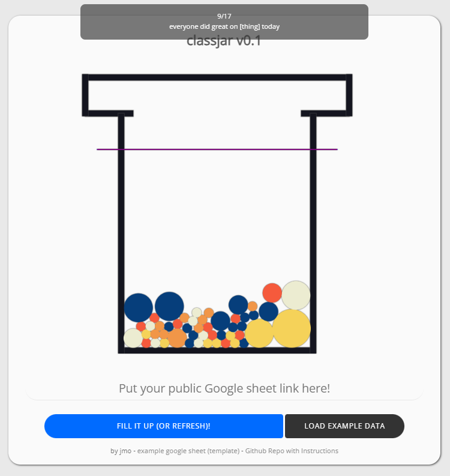
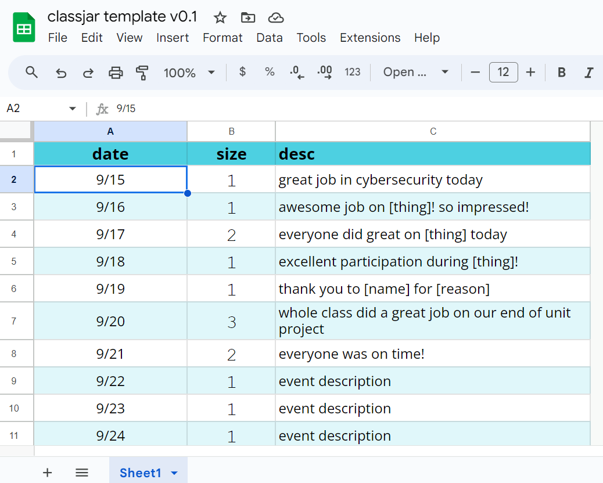

# classjar v0.1

Some teachers like to fill jars with marbles (or other items) as their students meet important goals or do good things.  Once the marbles in the jar reach a certain level, the class earns a prize or incentive from the teacher.  classjar is a simple static web-app that helps with that.  

## Screenshots

  
&nbsp; &nbsp; &nbsp; &nbsp;
  

## Setup Your Own

* Step 1:  Create your own copy of [this Google Sheet](https://docs.google.com/spreadsheets/d/1NcR-UuokzipcBvLNYg9BrT2SFD-EMqMmu1lIQR7JQ_s/edit?usp=sharing).
    * Avoid changing the column headings (date, size, desc).
* Step 2:  Get (copy) a **public share link** (i.e., "Anyone with the link can view") for your newly copied Google Sheet.
* Step 3:  Access the [live version of classjar here](https://frozenburrito.github.io/classjar/).  
* Step 4:  Paste your public share link into the [live version of classjar](https://frozenburrito.github.io/classjar/) and fill the jar!
* Step 5:  Implement, explain, announce reward, change sheet as appropriate (remove demo entries, etc).  

## Description & More Info

* Using a marble jar reward system can sometimes be a helpful classroom management strategy.  
    * This strategy is discussed in several popular teacher training manuals (e.g., ***Teach Like a Champion*** and ***First Days of School***)
* I thought it would be cool to create a web-app version of the marble jar reward system.  Here's what it does:
    * Pulls data from Google Sheet with three columns:  date, marble size, and description of positive thing.
    * For each row in the classjar google sheet, the app drops a marble in the jar.
        * Circle (marble) radius set as multiple of size column on Google Sheet. 
        * Click on any marble to see more info about how it was earned (date, description of positive thing).
    * It's up to the teacher to decide on an incentive earned when the marbles reach the reward bar (finish line).
* Marbles have physics!  
    * If you knock all the marbles out of the jar -- just reload!
* Basically, a data visualizing thing -- Visualize a Google Sheet that tracks positive classroom behaviors shown as a marble jar!  
 
## Authors

Jon Morris, [frozenburrito](https://github.com/frozenburrito)

## Version History
* 0.1
    * It works!

## Ideas for Future Features or Changes (To Do List)

* (major) Texture options for marbles
* (minor) Different jar options, sizes (svgs)
* (minor) Estimate marbles required to reach reward bars
* (major) Customizable reward bars (finish lines) with settable text
    * (major) Settable in Google Sheet
* (minor) [Stop bodies escaping pre-defined area](https://stackoverflow.com/questions/34520125/prevent-matterjs-bodies-form-escaping-a-predefined-area)

## Helpful Libraries

* [Matter.js](https://github.com/liabru/matter-js)
* [public-google-sheets-parser](https://github.com/fureweb-com/public-google-sheets-parser)

## Helpful Links

* [Marble Jar Reward System](https://www.theteachertoolkit.com/index.php/tool/marble-jar-rewards-system)
* [Accessing a public google sheet from client-side javascript](https://stackoverflow.com/questions/70902197/accessing-a-public-google-sheets-data-directly-from-client-side-javascript)
* [Matter.js bodies escaping from pre-defined area](https://stackoverflow.com/questions/34520125/prevent-matterjs-bodies-form-escaping-a-predefined-area)
* [Simple favicon generator](https://gauger.io/fonticon/)
